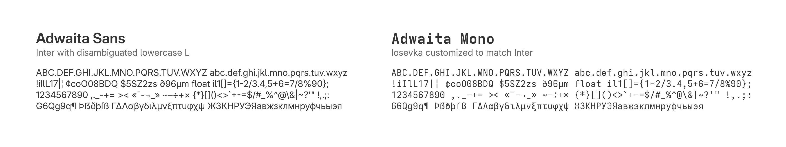

# Adwaita Fonts



This repository contains the build system for Adwaita Sans,
a variation of [Inter](https://rsms.me/inter/), and Adwaita Mono,
[Iosevka](https://typeof.net/Iosevka/) customized to match Inter.

## Usage

You can download the latest release from
[here](https://download.gnome.org/sources/adwaita-fonts/48/adwaita-fonts-48.0.tar.xz).
Install it by opening the `.ttf` files and clicking on “Install”.

### Setting the Fonts

```sh
gsettings set org.gnome.desktop.interface font-name "Adwaita Sans 11"
gsettings set org.gnome.desktop.interface monospace-font-name "Adwaita Mono 11"
```

### Resetting to Default

```sh
gsettings reset org.gnome.desktop.interface font-name
gsettings reset org.gnome.desktop.interface monospace-font-name
```
